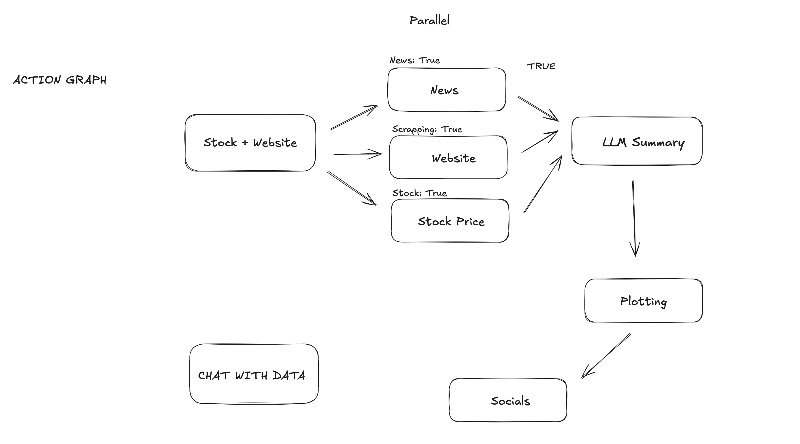

Before you can start using the library, you'll need to sign up for an account at Agent.ai and obtain a Bearer token from https://agent.ai/user/settings#credits.

#### How to run
- Create a virtual environment, activate it, install requirements (preferrably using Python 3.12.4)
- Create a bearer token and place in the .env
- run the command "streamlit run streamlit_app.py" on the terminal within the venv.

### The code is an Action graph agent. It performs market comparative assesment based on website date, market sentiments based on news data, and stocks price value.

Technical details:
- The state of the agent is monitored globally. Forexample "news: True", "website_fetch: False".
- The global state is designed because the agent is performing sequential operations. In case of parallel operations, each action would have its own local state.
- The agent uses agent.ai SDK.
- Agents are instantiated per task, terminated post-execution.
- All crew-mates execute in sequence by design and therefore, a global state is maintained. If it were designed to execute in parallel, it would help each crew would carry its own local state.

Functional Details:
- Agent is given the base information to work with: stock name + its website.
- A crew is instantiated that runs three operations to scrap the news, website content, and stock prices of that stock.
- Another crew is used to summarize the content scrapped.
- Lastly the final crew plots the stocks for comparative assesment.
- A standalone chat feature is also created (not a part of the agentic crews, but standalone), that could be used to further ask questions about the stocks.

Below is the schematic of the Agent.

